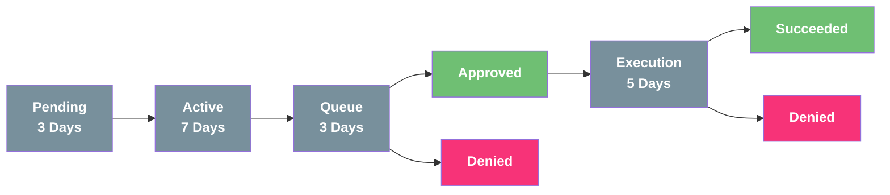

# Governance

## Receive Voting Power

A user will receive voting power by staking sKOINDX in the governance plugin.

The more sKOINDX a user holds, the more **staking rewards**, the more **discounts** and the more **voting power** he'll receive.

The amount of sKOINDX is equal to the voting power.

## Governance Process Diagram

## Phases

**PENDING PHASE**: Refers to the waiting time in which people can analyze the proposal and review the respective changes to be made.

**ACTIVE PHASE**: is the phase in which users can vote if they approve or deny the proposal.

**QUEUE PHASE**: During the queue phase, all votes are counted. After this phase, we will know if the proposal was successful or was denied by the users.

**EXECUTION PHASE**: The creator of the proposal has now the chance to execute the proposal.

**Note**: Until the proposal has been executed successfully, the proposal creator can cancel the proposal process at any time.

## Hash System

The hash system will be the main way to keep track of system calls and updates. Let’s start with the goal to update a contract that is managed by KoinDX governance. For updating this contract, the changes must be approved by an update proposal. This update proposal will have 1 or more hashes which will be generated with the information of the contract that will be uploaded.

The input data of the contract is taken, such as the bytecode, the address of the contract and the type of system call, with these data a sha256 is generated, which will be the hash that will be necessary in the update proposal.

For example, if we have the following data:

**Bytecode**:AGFzbQEAAAABMglgAn9_AGACf38Bf2ABfwBgAX8Bf2AAAGADf39_AGAAAX9gBX9_f39_AX9gA39_fwF_AhoBA2VudhJpbnZva2Vfc3lzdGVtX2NhbGwABwM=

**Contract address**: 1GxW5JVgQrw4rbpsnZvX5sxDYX8siRFuzw

**Type of call**: upload_contract

With these data, a hash of type sha-256 needs to be generated in the following order:

Type of call + Contract address + Bytecode

upload_contract 1GxW5JVgQrw4rbpsnZvX5sxDYX8siRFuzw AGFzbQEAAAABMglgAn9_AGACf38Bf2ABfwBgAX8Bf2AAAGADf39_AGAAAX9gBX9_f39_AX9gA39_fwF_AhoBA2VudhJpbnZva2Vfc3lzdGVtX2NhbGwABwM=

This combination of data generates a hash which will be the following:
_b6976cbbc5fc235b5d0c70cfb191f95db11517a809585a391ad6dad978737c6c_

If the government accepts the proposal, the hash is saved. When the contract is updated, the contract authority will request that the hash that was created with the update input data be saved. If the hash exists in the contract it means that the update was allowed and if it does not exist the update will be rejected.
